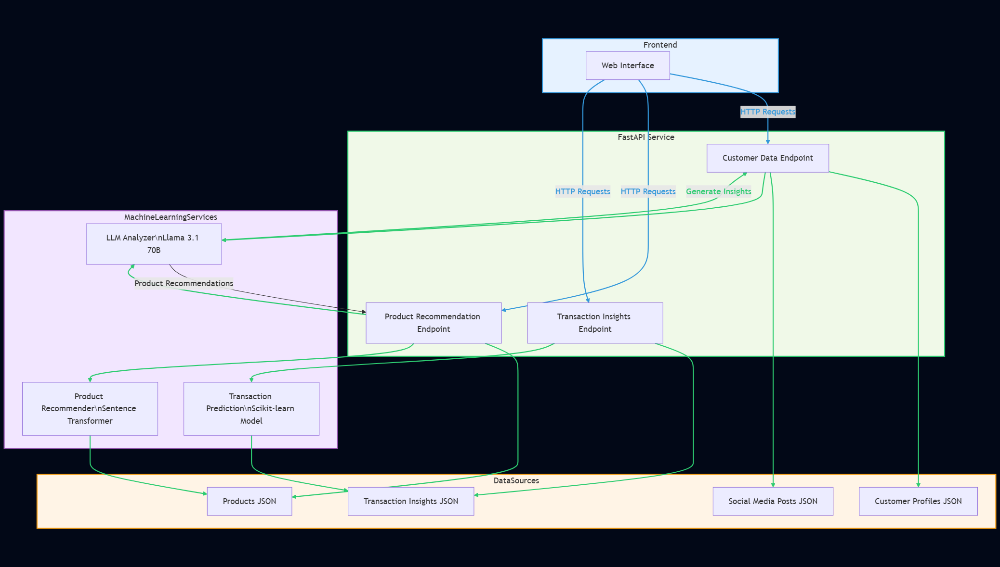

# Product Recommendation API Documentation

## Overview
This API provides personalized financial product recommendations based on customer profiles and their financial needs using natural language processing and vector similarity.

# Bank Product Recommendation System

## Architecture Diagram



## Table of Contents
- [Introduction](#introduction)
- [Demo](#demo)
- [Inspiration](#inspiration)
- [What It Does](#what-it-does)
- [How We Built It](#how-we-built-it)
- [Challenges We Faced](#challenges-we-faced)
- [How to Run](#how-to-run)
- [Tech Stack](#tech-stack)
- [Future Improvements](#future-improvements)

## Introduction
This project is an innovative financial recommendation platform designed to provide personalized product suggestions and insights for bank customers. By leveraging advanced machine learning techniques, natural language processing, and comprehensive data analysis, the system aims to enhance customer experience and financial product matching.

## Demo
The system offers a web-based interface that allows users to:
- Retrieve detailed customer profiles
- Generate personalized product recommendations
- Analyze customer transaction insights
- Predict future transaction behaviors
- Optimize existing bank products

## Inspiration
The inspiration behind this project stems from the need to:
- Improve customer financial experiences
- Provide data-driven, personalized banking solutions
- Utilize advanced AI technologies to understand customer needs
- Create a more intelligent and responsive banking ecosystem

## What It Does
The Bank Product Recommendation System provides several key functionalities:

1. **Customer Profile Analysis**
   - Retrieves comprehensive customer information
   - Combines customer profiles with social media data
   - Generates detailed profile summaries using AI

2. **Product Recommendations**
   - Uses semantic similarity to match customer needs with bank products
   - Generates personalized product suggestions
   - Provides detailed reasoning for each recommendation

3. **Transaction Insights**
   - Analyzes customer transaction history
   - Predicts future transaction amounts
   - Generates transaction behavior insights

4. **Product Optimization**
   - Offers suggestions for improving existing bank products
   - Uses AI to generate specific, actionable recommendations

## How We Built It
The system was built using a modular, microservice-based architecture:

1. **Data Management**
   - Utilized JSON files for storing customer, product, and transaction data
   - Implemented services to load and process data dynamically

2. **Machine Learning Components**
   - Used SentenceTransformer for semantic product matching
   - Implemented a predictive transaction model using scikit-learn
   - Leveraged pre-trained machine learning models

3. **AI-Powered Analysis**
   - Integrated OpenAI-compatible LLM (Llama 3.1 70B) for natural language processing
   - Created sophisticated prompts for generating insights
   - Implemented robust JSON parsing and cleaning mechanisms

4. **API Development**
   - Used FastAPI for creating a robust, scalable web service
   - Implemented CORS middleware for cross-origin compatibility
   - Created endpoints for various functionalities

## Challenges We Faced
1. **Data Integration**
   - Combining multiple data sources with different structures
   - Ensuring data quality and consistency

2. **AI Prompt Engineering**
   - Designing prompts that generate precise, relevant outputs
   - Handling various edge cases in language model responses

3. **Performance Optimization**
   - Managing computational resources for ML models
   - Implementing efficient vector similarity calculations

4. **Model Interpretation**
   - Translating complex AI insights into understandable recommendations
   - Maintaining transparency in recommendation generation

## How to Run
To run the project:

1. Clone the repository
2. Install dependencies:
   ```bash
   pip install -r requirements.txt
   ```
3. Set up environment variables
4. Run the FastAPI server:
   ```bash
   uvicorn main:app --reload
   ```

## Tech Stack
- **Programming Language**: Python
- **Web Framework**: FastAPI
- **Machine Learning**: 
  - SentenceTransformers
  - scikit-learn
  - NumPy
- **Natural Language Processing**: 
  - OpenAI/Llama 3.1 70B
- **Data Handling**: JSON
- **Libraries**: 
  - sentence-transformers
  - scipy
  - pickle
  - python-dotenv
- **Deployment**: Designed for containerization and cloud deployment

## Future Improvements
- Enhance model accuracy through continuous learning
- Expand data sources and integration
- Implement more advanced recommendation algorithms
- Add real-time transaction monitoring


## API Endpoints

### GET `/product_recommendations`
Returns personalized product recommendations for a customer with detailed reasons why each product is suitable.

**Parameters:**
- customerId

**Response:**
```json
{
  "Products": [
    {
      "Product_Name": "product name",
      "Reason": "Detailed reason why this product is suitable for the customer"
    },
    ...
  ]
}
```

## Modules

### Main Module (`main.py`)
This module contains the FastAPI application and endpoint definitions.

#### Functions

##### `get_product_recommendations()`
Endpoint to get personalized product recommendations for a customer.

**Returns:**
- JSON object containing product recommendations with reasons

##### `create_analysis_prompt(customer_profile)`
Create prompts for the LLM to analyze customer data.

**Parameters:**
- `customer_profile` (dict): The customer profile data

**Returns:**
- dict: Contains system_prompt and user_prompt for the LLM

### Customer Service (`customer_service.py`)
This module handles customer profile retrieval and processing.

#### Functions

##### `get_customer_profile(customer_id)`
Retrieve and combine customer profile with social media data.

**Parameters:**
- `customer_id` (str): The ID of the customer to retrieve

**Returns:**
- dict: Combined customer profile with personal and social media data

### LLM Service (`llm_service.py`)
This module manages interactions with the AI model.

#### Functions

##### `generate_customer_analysis(client, prompts)`
Generate customer analysis using the LLM.

**Parameters:**
- `client` (OpenAI): The OpenAI client
- `prompts` (dict): Dict containing system_prompt and user_prompt

**Returns:**
- dict: Parsed JSON response with customer analysis

##### `generate_product_recommendations(client, analysis, recommended_products)`
Generate detailed product recommendations using the LLM.

**Parameters:**
- `client` (OpenAI): The OpenAI client
- `analysis` (dict): Customer analysis result
- `recommended_products` (list): List of recommended products

**Returns:**
- dict: Detailed product recommendations with reasons

### Product Service (`product_service.py`)
This module encapsulates product recommendation logic.

#### Classes

##### `ProductRecommender`
A class to handle product recommendations using vector similarity.

###### Methods

###### `__init__(model_name='multi-qa-MiniLM-L6-cos-v1')`
Initialize the ProductRecommender with a sentence transformer model.

**Parameters:**
- `model_name` (str): Name of the sentence transformer model to use

###### `load_products(file_path="./data/products.json")`
Load and vectorize products from a JSON file.

**Parameters:**
- `file_path` (str): Path to the JSON file containing products

###### `get_recommendations(text, top_k=3)`
Get product recommendations based on text similarity.

**Parameters:**
- `text` (str): Text to compare products against
- `top_k` (int): Number of top recommendations to return

**Returns:**
- list: Top product recommendations

###### `_cosine_similarity(vec1, vec2)`
Calculate cosine similarity between two vectors.

**Parameters:**
- `vec1` (numpy.array): First vector
- `vec2` (numpy.array): Second vector

**Returns:**
- float: Similarity score (0-1)

#### Functions

##### `get_recommended_products(text)`
Get product recommendations based on text.

**Parameters:**
- `text` (str): Text describing customer needs

**Returns:**
- list: Recommended products

## Data Requirements

The application expects the following data files:
- `./data/updated_customer_profile.json`: Customer profile information
- `./data/non_contradictory_social_media_posts.json`: Social media posts linked to customers
- `./data/products.json`: Product catalog with descriptions and features

## Setup and Deployment

### Installing Dependencies
pip install -r requirements.txt

### Environment Variables
- `SAMBANOVA_API_KEY`: API key for accessing the SambaNova LLM service

### Starting the Server
```bash
uvicorn src.main:app --reload
```
